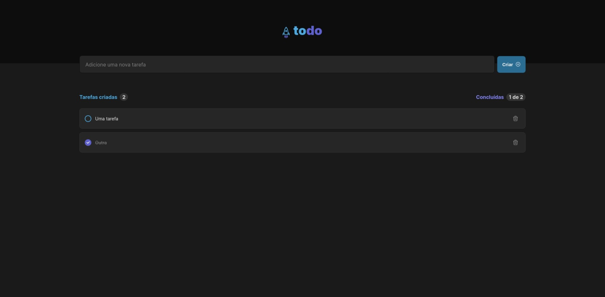

<p align="center">
    <a href="#-projeto">🖥 Projeto</a>&nbsp;&nbsp;&nbsp;|&nbsp;&nbsp;&nbsp;
    <a href="#-projeto">🔗 Links</a>&nbsp;&nbsp;&nbsp;|&nbsp;&nbsp;&nbsp;
    <a href="#-tecnologias">👨‍💻 Tecnologias</a>&nbsp;&nbsp;&nbsp;|&nbsp;&nbsp;&nbsp;
    <a href="#-executar-o-projeto">🖇 Execução do Projeto</a>&nbsp;&nbsp;&nbsp;|&nbsp;&nbsp;&nbsp;
    <a href="#-licença">📃 Licença</a>&nbsp;&nbsp;&nbsp;|&nbsp;&nbsp;&nbsp;
    <a href="#-observações">📌 Observações</a>
</p>
<div style="display: flex; flex-direction: row; justify-content: center; align-items: center; flex-wrap: wrap"  align="center">
    
</div>


## 🖥 Projeto
O **Todo List** é um projeto desenvolvido como desafio do ignite, programa de especialização da Rocketseat, e consiste em um sistema de lista de tarefas, na qual é possível manipular as diversas atividades.
As tecnologias usadas nesse projeto foram:
- [React](https://pt-br.reactjs.org/)
- [CSS Module](https://css-tricks.com/css-modules-part-1-need/)
- [Typescript](https://www.typescriptlang.org/)
- [Cypress](https://www.cypress.io/)


## 🔗 Links

🤖 Link para o projeto hospeado: [Todo List](https://todo-list-hazel-six.vercel.app/)

🎨 Link para o design do projeto: [Figma - Todo List](https://www.figma.com/file/SGEtlR5NGJezLRqvpaU7IH/ToDo-List-(Copy)?t=QMgPYJ7Zpq0boNCJ-0)


## 🖇 Executar o Projeto
Para executar o projeto, apenas é preciso clonar ele em seu dispositivo:

- Clone o repositório:
    ```bash
    $ git clone https://github.com/Yta-ux/react-ignite.git
    ```
- Acesse a pasta do projeto:
    ```bash
    $ cd react-ignite/todo-list
    ```
 -  Instale as dependências do projeto:
    ```bash
    $ yarn
    ```
 - Após isso, execute o projeto:
    ```bash
    $ yarn dev
    ```
 
##  📃 Licença
Esse projeto possui licença MIT. Para mais detalhes consulte o arquivo [LICENSE](LICENSE.md)


## 📌 Observações
- Primeiro desafio do Ignite
